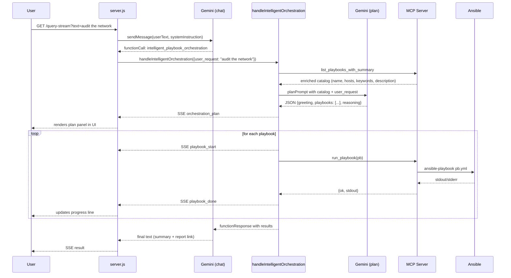
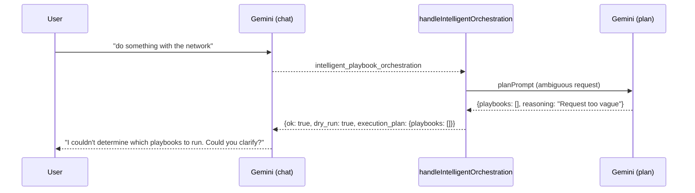
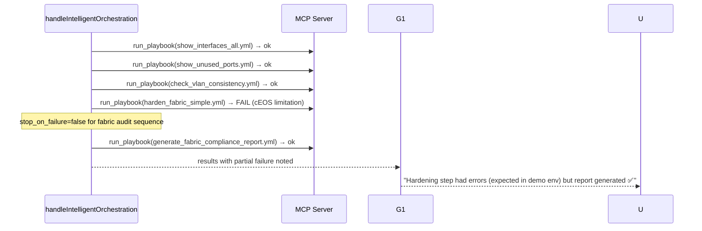

# Design Document: AI Playbook Orchestration

## Overview

This feature removes the hardcoded `fabric_audit_all.yml` mapping from the AI system instruction and replaces it with a fully dynamic, AI-driven orchestration path. When a user types a natural-language request like "audit the network" or "generate fabric report", Gemini intelligently selects the individual playbooks to run, presents a plan to the user, and executes them one by one with live SSE progress — making the experience feel like the AI figured it out rather than a single hardcoded playbook firing.

The existing `intelligent_playbook_orchestration` tool in `server.js` already implements the core execution engine (plan → stream → execute). The primary changes are: (1) enriching the playbook catalog fed to Gemini so selection is accurate, (2) updating the system instruction to route fabric audit queries through the orchestration tool instead of `fabric_audit_all.yml`, (3) hardening the orchestration prompt to prevent wrong-playbook selection, and (4) adding a **Hybrid Rule Boost** layer that pre-seeds known playbook sets for critical queries before Gemini is even called — guaranteeing correctness for high-stakes flows while keeping AI flexibility for everything else.

## Architecture

```mermaid
graph TD
    U[User: "audit the network"] --> FE[Express Frontend / server.js]
    FE --> GEM1[Gemini — Main Chat Model]
    GEM1 -->|tool call: intelligent_playbook_orchestration| ORCH[handleIntelligentOrchestration]
    ORCH --> RULE[Rule Boost Layer]
    RULE -->|keyword match found: inject forced playbooks| MERGE[Merge forced + AI plan]
    RULE -->|no match: pure AI path| MCP1[MCP: list_playbooks_with_summary]
    MCP1 --> CAT[Enriched Playbook Catalog]
    CAT --> GEM2[Gemini — Plan Model]
    GEM2 -->|JSON plan| MERGE
    MERGE -->|final deduplicated ordered list| EXEC[Execution Loop]
    EXEC -->|SSE: orchestration_plan| UI[Browser / app.js]
    EXEC --> MCP2[MCP: run_playbook × N]
    MCP2 -->|SSE: playbook_start / playbook_done| UI
    MCP2 --> ANS[Ansible Playbooks]
    ANS --> RPT[Reports on disk]
    EXEC --> GEM1
    GEM1 -->|SSE: result| UI
```

The key architectural shift: `fabric_audit_all.yml` is no longer in the AI's decision path. The system instruction's "Fabric Audit" section is rewritten to route those queries to `intelligent_playbook_orchestration`, which uses a **two-layer selection strategy**:

- **Layer 1 — Rule Boost**: keyword matching pre-seeds a guaranteed correct playbook set for known critical flows (fabric audit, compliance report, etc.) before Gemini is called
- **Layer 2 — AI Selection**: Gemini fills in anything the rule layer didn't cover, and handles all novel/unknown requests purely dynamically

The two layers are merged and deduplicated, preserving correct execution order.

## Sequence Diagrams

### Happy Path — "audit the network"



### Edge Case — Unknown / Ambiguous Request



### Edge Case — Partial Failure (hardening fails, report still generated)



## Components and Interfaces

### Component 1: System Instruction (SYSTEM_INSTRUCTION in server.js)

**Purpose**: Tells Gemini when to use `intelligent_playbook_orchestration` vs direct `run_playbook`.

**Current problem**: The "Fabric Audit" section explicitly maps fabric audit queries to `fabric_audit_all.yml` via `run_playbook`. This bypasses the orchestration tool entirely.

**Change**: Replace the entire "Fabric Audit (CRITICAL MAPPINGS)" block with an "Intelligent Orchestration" routing rule that sends fabric audit queries to `intelligent_playbook_orchestration`.

**Interface** (the routing rule added to SYSTEM_INSTRUCTION):
```
Intelligent Orchestration — Fabric Audit Queries:
- When user says ANY of: "audit the full fabric", "fabric audit", "fabric report",
  "fabric compliance", "operations summary", "quick operations summary",
  "show down interfaces", "list unused ports", "verify vlan consistency",
  "apply baseline hardening", "generate compliance report", "compliance report",
  "audit the network", "generate fabric report", or any combination of these
  → ALWAYS call: intelligent_playbook_orchestration with user_request set to
    the user's exact message. Do NOT call run_playbook(fabric_audit_all.yml).
- The orchestration tool will select the correct individual playbooks, show the
  user a plan, and execute them with live progress.
- After completion, provide the compliance report link: BASE_URL/reports/fabric_compliance/index.html
```

**Responsibilities**:
- Route fabric audit intent to `intelligent_playbook_orchestration`
- Keep `fabric_audit_all.yml` out of the AI's routing decisions
- Preserve all other existing routing rules unchanged

### Component 2: Playbook Catalog (mcp_server.py — _extract_playbook_info)

**Purpose**: Provides Gemini with rich metadata about each playbook so it can make accurate selections.

**Current state**: `_extract_playbook_info` auto-extracts keywords from YAML task names and module names. This is functional but produces generic keywords like `["copy", "debug", "file", "shell"]` that don't help Gemini distinguish playbooks semantically.

**Change**: Add a static `PLAYBOOK_CATALOG` dict in `mcp_server.py` that overlays curated metadata on top of the auto-extracted info. The catalog provides human-readable descriptions, intent keywords, and explicit ordering hints.

**Interface**:
```python
PLAYBOOK_CATALOG: Dict[str, Dict[str, Any]] = {
    "show_interfaces_all.yml": {
        "description": "Collects interface status from all fabric devices and routers. Saves per-device reports to reports/.",
        "intent_keywords": ["interfaces", "interface status", "show interfaces", "port status", "link status"],
        "hosts": "fabric + routers",
        "produces": "reports/*_interfaces_all.txt",
        "order_hint": 1,
    },
    "show_unused_ports.yml": {
        "description": "Identifies unused/disabled/notconnect ports on all fabric devices. Saves per-device unused port reports.",
        "intent_keywords": ["unused ports", "disabled ports", "notconnect", "idle ports", "port utilization"],
        "hosts": "fabric + routers",
        "produces": "reports/*_unused_ports.txt",
        "order_hint": 2,
    },
    "check_vlan_consistency.yml": {
        "description": "Verifies VLAN database consistency across all fabric switches. Saves per-device VLAN reports.",
        "intent_keywords": ["vlan", "vlan consistency", "vlan check", "vlan verification", "layer 2"],
        "hosts": "fabric",
        "produces": "reports/*_vlans.txt",
        "order_hint": 3,
    },
    "harden_fabric_simple.yml": {
        "description": "Applies baseline security hardening to fabric devices: login banner, NTP, SSH config. Saves hardening audit per device.",
        "intent_keywords": ["harden", "hardening", "security", "baseline", "banner", "ntp", "ssh"],
        "hosts": "fabric",
        "produces": "reports/hardening/*_hardening.txt",
        "order_hint": 4,
    },
    "generate_fabric_compliance_report.yml": {
        "description": "Generates an HTML compliance dashboard at reports/fabric_compliance/index.html. Requires prior interface, unused ports, VLAN, and hardening data.",
        "intent_keywords": ["compliance report", "fabric report", "html report", "dashboard", "audit report"],
        "hosts": "fabric + routers",
        "produces": "reports/fabric_compliance/index.html",
        "order_hint": 5,
    },
    # ... other playbooks
}
```

**Responsibilities**:
- Provide intent-level keywords (what a user would say, not what the YAML says)
- Indicate what each playbook produces (for post-run link generation)
- Provide ordering hints so Gemini sequences prerequisites correctly

### Component 3: Orchestration Prompt (handleIntelligentOrchestration in server.js)

**Purpose**: The prompt sent to Gemini's plan model to select and order playbooks.

**Current state**: The prompt is minimal — it lists playbook names with hosts and keywords, then asks Gemini to pick. It works but is vulnerable to hallucination (picking `fabric_audit_all.yml` itself) and doesn't handle partial-failure semantics.

**Change**: Enrich the prompt with explicit exclusion rules, ordering guidance, and a `stop_on_failure` field in the JSON response schema.

**Interface** (updated planPrompt structure):
```
You are an Ansible playbook orchestration assistant for a network fabric.

IMPORTANT RULES:
1. NEVER select "fabric_audit_all.yml" — it is a legacy orchestrator, not an individual task.
2. Only select playbooks from the Available Playbooks list below.
3. Order matters: prerequisites first (interfaces → unused ports → vlans → hardening → report).
4. Be minimal: only include playbooks directly relevant to the user's request.
5. If the request mentions "compliance report" or "fabric report", always include
   generate_fabric_compliance_report.yml LAST, and include its prerequisites.
6. If the request is too vague or nothing matches, return empty playbooks array.

Available playbooks:
{enriched catalog lines}

User request: "{userRequest}"

Respond ONLY with valid JSON:
{
  "greeting": "Hello! To achieve your goal, I will run the following playbooks:",
  "playbooks": ["playbook1.yml", "playbook2.yml"],
  "reasoning": "One sentence explaining why these were chosen",
  "stop_on_failure": false
}

The stop_on_failure field: set to false when hardening is included (it may fail in demo env
but subsequent steps should still run). Set to true otherwise.
```

**Responsibilities**:
- Explicitly exclude `fabric_audit_all.yml` from selection
- Enforce prerequisite ordering for the compliance report
- Signal `stop_on_failure=false` when hardening is in the sequence

### Component 4: SSE Event Flow (handleIntelligentOrchestration + app.js)

**Purpose**: Streams real-time progress to the browser as each playbook runs.

**Current state**: Already implemented and working. The UI handles `orchestration_plan`, `playbook_start`, `playbook_done` events correctly.

**No changes needed** to `app.js`. The only change is ensuring `stop_on_failure` from the plan is respected in the execution loop.

**Interface** (SSE event types, unchanged):
```typescript
// orchestration_plan — emitted once before execution starts
{ type: "orchestration_plan", greeting: string, playbooks: string[], reasoning: string }

// playbook_start — emitted before each playbook runs
{ type: "playbook_start", playbook: string }

// playbook_done — emitted after each playbook completes
{ type: "playbook_done", playbook: string, ok: boolean }
```

### Component 5: Rule Boost Layer (handleIntelligentOrchestration in server.js)

**Purpose**: Pre-seeds a guaranteed correct playbook set for known critical query patterns *before* Gemini is called. This eliminates AI dependency for high-stakes flows while keeping full AI flexibility for everything else.

**Why it matters**: For queries like "generate fabric report", the correct 5-playbook sequence is deterministic and well-known. Relying purely on AI introduces a small but non-zero risk of wrong selection. The rule layer removes that risk entirely for critical flows.

**Interface** (the `RULE_BOOST_MAP` constant in `server.js`):
```javascript
const RULE_BOOST_MAP = [
  {
    // Fabric audit / compliance report — always needs these 5 in order
    keywords: [
      "fabric report", "fabric audit", "audit the network", "audit network",
      "compliance report", "generate report", "operations summary",
      "fabric compliance", "full audit"
    ],
    playbooks: [
      "show_interfaces_all.yml",
      "show_unused_ports.yml",
      "check_vlan_consistency.yml",
      "harden_fabric_simple.yml",
      "generate_fabric_compliance_report.yml"
    ],
    stop_on_failure: false   // hardening may fail in cEOS — continue anyway
  },
  {
    // VLAN-only queries
    keywords: ["check vlan", "vlan consistency", "verify vlan", "vlan check"],
    playbooks: ["check_vlan_consistency.yml"],
    stop_on_failure: true
  },
  {
    // Interface-only queries
    keywords: ["show interfaces", "interface status", "show all interfaces"],
    playbooks: ["show_interfaces_all.yml"],
    stop_on_failure: true
  }
];
```

**Algorithm**:
```javascript
function applyRuleBoost(userRequest) {
  const q = userRequest.toLowerCase();
  for (const rule of RULE_BOOST_MAP) {
    if (rule.keywords.some(kw => q.includes(kw))) {
      return { forcedPlaybooks: rule.playbooks, stop_on_failure: rule.stop_on_failure };
    }
  }
  return null;  // no match — fall through to pure AI
}
```

**Merge strategy** (when both rule boost AND AI plan produce results):
```javascript
// Deduplicate: AI may add extra playbooks not in the forced set
// Preserve order: forced playbooks first (they define the correct sequence)
// Then append any AI-suggested playbooks not already in the list
const merged = [...forcedPlaybooks];
for (const pb of aiPlaybooks) {
  if (!merged.includes(pb) && pb !== 'fabric_audit_all.yml') {
    merged.push(pb);
  }
}
```

**Responsibilities**:
- Match known critical query patterns via simple `includes()` — no regex, no AI call needed
- Return a pre-validated ordered playbook list for matched patterns
- Fall through to pure AI for unmatched queries (novel requests, unknown combos)
- Always exclude `fabric_audit_all.yml` from forced sets

**Postconditions**:
- If a rule matches: `forcedPlaybooks` is always a non-empty, correctly ordered list
- If no rule matches: returns `null` — AI handles it entirely
- `fabric_audit_all.yml` never appears in any `forcedPlaybooks` list

### Enriched Playbook Catalog Entry

```typescript
interface PlaybookCatalogEntry {
  filename: string           // e.g. "show_interfaces_all.yml"
  name: string               // human-readable name from YAML
  description: string        // curated intent description
  intent_keywords: string[]  // what a user would say to trigger this
  hosts: string              // target host group(s)
  produces: string           // output artifact path pattern
  order_hint: number         // suggested execution order (1-N)
  modules: string[]          // auto-extracted Ansible modules
  inputs: string[]           // auto-extracted vars/inputs
}
```

### Orchestration Plan (Gemini JSON response)

```typescript
interface OrchestrationPlan {
  greeting: string      // shown to user before execution
  playbooks: string[]   // ordered list of filenames to run
  reasoning: string     // one-sentence explanation
  stop_on_failure: boolean  // whether to halt on first failure
}
```

### Execution Result (returned to Gemini after all playbooks run)

```typescript
interface OrchestrationResult {
  ok: boolean
  user_request: string
  execution_plan: {
    playbooks: string[]
    reasoning: string
  }
  execution_results: Array<{
    playbook: string
    ok: boolean
    stdout?: string
    stderr?: string
    error?: string
  }>
}
```

## Algorithmic Pseudocode

### Main Orchestration Algorithm

```pascal
ALGORITHM handleIntelligentOrchestration(args, onProgress)
INPUT: args.user_request, args.dry_run, args.limit, args.extra_vars
OUTPUT: OrchestrationResult

BEGIN
  // Step 1: Rule Boost — check known critical patterns first
  ruleMatch ← applyRuleBoost(args.user_request)
  
  IF ruleMatch IS NOT NULL THEN
    // Known pattern: use pre-validated playbook set, skip AI planning
    forcedPlaybooks ← ruleMatch.forcedPlaybooks
    stopOnFailure ← ruleMatch.stop_on_failure
    greeting ← "Hello! Based on your request, I've identified the following playbooks to run:"
    reasoning ← "Selected based on known fabric audit workflow"
  ELSE
    // Unknown pattern: fall through to AI planning
    forcedPlaybooks ← []
    stopOnFailure ← true
  END IF

  // Step 2: Fetch enriched catalog (always needed — for AI path or to validate forced set)
  catalog ← MCP.call("list_playbooks_with_summary")
  playbookLines ← formatCatalogForPrompt(catalog.playbooks)  // excludes fabric_audit_all.yml

  // Step 3: AI Planning (only if no rule match, or to supplement forced set)
  IF ruleMatch IS NULL THEN
    planPrompt ← buildPlanPrompt(playbookLines, args.user_request)
    planText ← Gemini.generateContent(planPrompt)
    plan ← parseJSON(planText)
    aiPlaybooks ← plan.playbooks.filter(pb ≠ "fabric_audit_all.yml")
    stopOnFailure ← plan.stop_on_failure ?? true
    greeting ← plan.greeting
    reasoning ← plan.reasoning
  ELSE
    aiPlaybooks ← []  // rule match is sufficient
  END IF

  // Step 4: Merge forced + AI playbooks (deduplicated, forced order preserved)
  finalPlaybooks ← merge(forcedPlaybooks, aiPlaybooks)

  // Step 5: Emit plan to UI
  onProgress({ type: "orchestration_plan", greeting, playbooks: finalPlaybooks, reasoning })

  IF finalPlaybooks IS EMPTY OR args.dry_run THEN
    RETURN { ok: true, dry_run: true, execution_plan: { playbooks: finalPlaybooks } }
  END IF

  // Step 6: Execute playbooks one by one
  results ← []
  overallOk ← true

  FOR each pb IN finalPlaybooks DO
    onProgress({ type: "playbook_start", playbook: pb })

    TRY
      res ← MCP.call("run_playbook", { playbook: pb, limit: args.limit })
    CATCH error
      res ← { ok: false, error: error.message }
    END TRY

    onProgress({ type: "playbook_done", playbook: pb, ok: res.ok })
    results.append({ playbook: pb, ...res })

    IF NOT res.ok AND stopOnFailure THEN
      overallOk ← false
      BREAK
    END IF

    IF NOT res.ok THEN
      overallOk ← false
      // continue to next playbook (stop_on_failure=false)
    END IF
  END FOR

  RETURN { ok: overallOk, user_request: args.user_request,
           execution_plan: { playbooks: finalPlaybooks, reasoning },
           execution_results: results }
END
```

**Preconditions:**
- `args.user_request` is a non-empty string
- Gemini API key is valid and accessible
- MCP server process can be spawned

**Postconditions:**
- `orchestration_plan` SSE event is always emitted before any execution
- Each playbook emits `playbook_start` before and `playbook_done` after
- `fabric_audit_all.yml` is never in `execution_results`
- If `stop_on_failure=false`, all playbooks run regardless of individual failures

**Loop Invariants:**
- `results` contains one entry per playbook that was attempted
- `onProgress` is called in order: plan → (start, done)* per playbook

### Catalog Formatting Algorithm

```pascal
ALGORITHM formatCatalogForPrompt(playbooks)
INPUT: playbooks — list of PlaybookCatalogEntry
OUTPUT: formatted string for plan prompt

BEGIN
  lines ← []
  FOR each pb IN playbooks DO
    IF pb.filename = "fabric_audit_all.yml" THEN
      CONTINUE  // explicitly exclude from catalog shown to plan model
    END IF
    
    keywords ← merge(pb.intent_keywords, pb.keywords).slice(0, 10)
    line ← "- {pb.filename}: {pb.description} | hosts={pb.hosts} | keywords=[{keywords.join(', ')}]"
    lines.append(line)
  END FOR
  RETURN lines.join("\n")
END
```

**Postconditions:**
- `fabric_audit_all.yml` never appears in the formatted catalog
- Each line contains filename, description, hosts, and keywords

## Key Functions with Formal Specifications

### handleIntelligentOrchestration(args, onProgress)

**Preconditions:**
- `args.user_request` is a non-empty trimmed string
- `onProgress` is a function or null
- Gemini API key is set in environment

**Postconditions:**
- Returns `OrchestrationResult` with `ok` field
- If `plan.playbooks` is empty: returns `dry_run: true` without executing
- If execution runs: `execution_results.length === playbooks attempted`
- `fabric_audit_all.yml` is never in `execution_results`

**Loop Invariants (execution loop):**
- After iteration i: `results` has exactly i entries
- `overallOk` is false if any previous playbook failed

### buildPlanPrompt(playbookLines, userRequest)

**Preconditions:**
- `playbookLines` is a non-empty string (catalog formatted without `fabric_audit_all.yml`)
- `userRequest` is a non-empty string

**Postconditions:**
- Returned string contains explicit rule: "NEVER select fabric_audit_all.yml"
- Returned string contains the JSON schema for the response
- Returned string contains `stop_on_failure` field in the schema

### _extract_playbook_info(pb_path) — enriched version

**Preconditions:**
- `pb_path` is a valid Path to a `.yml` file

**Postconditions:**
- If `pb_path.name` is in `PLAYBOOK_CATALOG`: returned dict merges catalog metadata over auto-extracted info
- `description` field is always present and non-empty
- `intent_keywords` field is always a list (may be empty for uncatalogued playbooks)

## Error Handling

### Error Scenario 1: Gemini returns invalid JSON for the plan

**Condition**: `planText` from Gemini plan model cannot be parsed as JSON.

**Response**: Return `{ ok: false, error: "Failed to parse orchestration plan from Gemini", raw: planText }` to the main chat model. Gemini will surface a user-friendly error message.

**Recovery**: The main chat model can retry with `intelligent_playbook_orchestration` or fall back to asking the user to clarify.

### Error Scenario 2: Gemini hallucinates `fabric_audit_all.yml` in the plan

**Condition**: Despite the exclusion rule in the prompt, Gemini includes `fabric_audit_all.yml` in `plan.playbooks`.

**Response**: Server-side filter in `handleIntelligentOrchestration` removes it before execution:
```javascript
plan.playbooks = (plan.playbooks || []).filter(pb => pb !== 'fabric_audit_all.yml');
```

**Recovery**: Execution continues with the remaining playbooks. If the filtered list is empty, returns `dry_run: true` and Gemini asks the user to clarify.

### Error Scenario 3: Individual playbook fails (e.g. harden_fabric_simple.yml in cEOS)

**Condition**: `run_playbook` returns `ok: false` for a playbook in the sequence.

**Response**: 
- If `stop_on_failure=true` (default): execution halts, remaining playbooks are skipped.
- If `stop_on_failure=false` (set by plan model when hardening is included): execution continues to next playbook.

**Recovery**: The `execution_results` array captures per-playbook status. The main Gemini model receives the full results and can explain partial failures to the user (e.g., "Hardening step had errors — expected in demo environment — but the compliance report was generated successfully").

### Error Scenario 4: MCP process fails to start or times out

**Condition**: `startMcpProcess()` fails or a `run_playbook` call exceeds the 5-minute timeout.

**Response**: The `catch` block in the execution loop catches the error and records `{ ok: false, error: error.message }` for that playbook. The `playbook_done` SSE event is emitted with `ok: false`.

**Recovery**: Execution halts (stop_on_failure=true) or continues (stop_on_failure=false). The user sees a ❌ on the failed playbook in the UI.

### Error Scenario 5: User request is too vague (no matching playbooks)

**Condition**: Gemini plan model returns `{ playbooks: [] }` because the request doesn't map to any known playbook.

**Response**: `handleIntelligentOrchestration` returns `{ ok: true, dry_run: true, execution_plan: { playbooks: [] } }`. The main Gemini model receives this and asks the user to clarify.

**Recovery**: User rephrases their request. No playbooks were executed, no side effects.

## Testing Strategy

### Unit Testing Approach

Test the catalog formatting and plan parsing logic in isolation:

- `formatCatalogForPrompt` never includes `fabric_audit_all.yml` in output
- `parseOrchestrationPlan` handles malformed JSON gracefully (returns error object)
- `handleIntelligentOrchestration` with `dry_run=true` never calls `run_playbook`
- Server-side filter removes `fabric_audit_all.yml` even if Gemini returns it

### Property-Based Testing Approach

**Property Test Library**: fast-check

Properties to verify:

1. For any user request string, `formatCatalogForPrompt` output never contains the substring `"fabric_audit_all.yml"`.

2. For any `OrchestrationPlan` returned by the plan model, after the server-side filter, `plan.playbooks` never contains `"fabric_audit_all.yml"`.

3. For any execution sequence where `stop_on_failure=false`, `execution_results.length` equals `plan.playbooks.length` (all playbooks attempted regardless of failures).

4. For any execution sequence where `stop_on_failure=true` and playbook at index `k` fails, `execution_results.length` equals `k + 1` (halts after first failure).

5. **Hybrid merge property**: For any combination of `forcedPlaybooks` and `aiPlaybooks`, the merged result contains all entries from `forcedPlaybooks` in their original order, followed by any `aiPlaybooks` entries not already present, and never contains `"fabric_audit_all.yml"`.

6. **Rule boost determinism**: For any query string containing a known keyword (e.g. `"fabric report"`), `applyRuleBoost` always returns the same pre-validated playbook list — regardless of how many times it is called or what other text surrounds the keyword.

### Integration Testing Approach

End-to-end test using the existing `test_intelligent_orchestration.py`:

- Send "audit the network" → verify `orchestration_plan` SSE event contains the 5 fabric playbooks in correct order, none of which is `fabric_audit_all.yml`
- Send "generate fabric report" → verify same 5-playbook sequence
- Send "check vlan consistency" → verify only `check_vlan_consistency.yml` is selected
- Send "show interfaces and check vlans" → verify `["show_interfaces_all.yml", "check_vlan_consistency.yml"]`
- Verify `fabric_audit_all.yml` is never selected for any of the above queries

## Performance Considerations

The orchestration path adds one extra Gemini API call (the plan model call) before execution begins. This adds approximately 1-3 seconds of latency before the first playbook starts. This is acceptable because:

1. The `orchestration_plan` SSE event is emitted immediately after the plan is generated, so the user sees the plan while playbooks are queuing.
2. The plan model call uses the same `GEMINI_MODEL` (gemini-2.5-flash) which is fast.
3. The catalog passed to the plan model is kept compact — one line per playbook, max 10 keywords each.

To minimize catalog size, `formatCatalogForPrompt` excludes `fabric_audit_all.yml` and limits keywords to 10 per playbook.

## Security Considerations

- The server-side filter (`plan.playbooks.filter(pb => pb !== 'fabric_audit_all.yml')`) is a defense-in-depth measure against prompt injection attacks that might try to force the orchestrator to run the legacy playbook.
- All playbook execution still goes through `mcp_server.py`'s `_resolve_playbook` allow-list, which validates filenames against the actual `playbooks/` directory. Gemini cannot inject arbitrary shell commands.
- The `SAFE_TOKEN_RE` regex in `mcp_server.py` validates `limit` and `tags` parameters, preventing injection via those fields.
- The Gemini API key remains in `frontend/.env` and is never exposed to the browser.

## Dependencies

- `@google/generative-ai` — already installed, used for both main chat and plan model calls
- `mcp_server.py` — no new Python dependencies; catalog overlay uses existing `yaml` and `pathlib`
- `fabric_audit_all.yml` — stays on disk, untouched; simply removed from AI routing
- Existing SSE event handlers in `app.js` — no changes needed

## Correctness Properties

*A property is a characteristic or behavior that should hold true across all valid executions of a system — essentially, a formal statement about what the system should do. Properties serve as the bridge between human-readable specifications and machine-verifiable correctness guarantees.*

### Property 1: Rule boost returns correct playbook list for any matching request

For any user request string that contains at least one keyword from a `RULE_BOOST_MAP` entry (case-insensitive), `applyRuleBoost` shall return the pre-validated ordered playbook list associated with that entry.

**Validates: Requirements 2.2**

### Property 2: Rule boost returns null for any non-matching request

For any user request string that contains none of the keywords in any `RULE_BOOST_MAP` entry, `applyRuleBoost` shall return null.

**Validates: Requirements 2.3**

### Property 3: Rule boost never returns fabric_audit_all.yml

For any user request string, if `applyRuleBoost` returns a non-null result, the returned playbook list shall not contain the string `"fabric_audit_all.yml"`.

**Validates: Requirements 2.7**

### Property 4: Catalog formatting never exposes fabric_audit_all.yml to the Plan_Model

For any playbook catalog array (regardless of whether it contains `fabric_audit_all.yml`), the string produced by `formatCatalogForPrompt` shall not contain the substring `"fabric_audit_all.yml"`.

**Validates: Requirements 4.6, 5.1**

### Property 5: Server-side filter removes fabric_audit_all.yml from any plan

For any array of playbook filenames (including arrays that contain `"fabric_audit_all.yml"` zero or more times), after applying the server-side filter, the resulting array shall not contain `"fabric_audit_all.yml"`.

**Validates: Requirements 5.2**

### Property 6: All PLAYBOOK_CATALOG entries contain required fields

For any entry in `PLAYBOOK_CATALOG`, the entry shall contain non-empty values for `description`, `intent_keywords` (a non-empty list), `hosts`, `produces`, and `order_hint` (a positive integer).

**Validates: Requirements 3.4**

### Property 7: _extract_playbook_info always returns a non-empty description

For any valid `.yml` playbook file path, `_extract_playbook_info` shall return a dict with a non-empty `description` field.

**Validates: Requirements 3.5**

### Property 8: PLAYBOOK_CATALOG metadata overrides auto-extracted info

For any playbook whose filename is a key in `PLAYBOOK_CATALOG`, the dict returned by `_extract_playbook_info` shall have `description` and `intent_keywords` values equal to those in `PLAYBOOK_CATALOG`, not the auto-extracted values.

**Validates: Requirements 3.2**

### Property 9: stop_on_failure=false causes all playbooks to be attempted

For any ordered list of N playbooks and any subset of those playbooks that fail, when `stop_on_failure` is false, the `execution_results` array shall contain exactly N entries (one per playbook, in order).

**Validates: Requirements 6.1, 6.3**

### Property 10: stop_on_failure=true halts after the first failure

For any ordered list of N playbooks where playbook at index k (0-based) is the first to fail, when `stop_on_failure` is true, the `execution_results` array shall contain exactly k+1 entries.

**Validates: Requirements 6.2, 6.3**

### Property 11: overallOk is false when any playbook in the sequence failed

For any execution sequence where at least one playbook returns `ok: false`, the `OrchestrationResult.ok` field shall be false regardless of the `stop_on_failure` setting.

**Validates: Requirements 6.4**

### Property 12: Hybrid merge preserves forced order, appends AI additions, and excludes duplicates and fabric_audit_all.yml

For any `forcedPlaybooks` list and any `aiPlaybooks` list, the merged result shall: (a) begin with all entries from `forcedPlaybooks` in their original order, (b) be followed by any entries from `aiPlaybooks` not already present in `forcedPlaybooks`, (c) contain no duplicate entries, and (d) not contain `"fabric_audit_all.yml"`.

**Validates: Requirements 8.1, 8.2, 8.3, 8.4**

### Property 13: orchestration_plan SSE event is emitted exactly once and before any playbook_start event

For any invocation of `handleIntelligentOrchestration` with a non-empty playbook list, the sequence of SSE events emitted shall contain exactly one `orchestration_plan` event, and it shall appear before any `playbook_start` event in the sequence.

**Validates: Requirements 7.1, 7.4**
