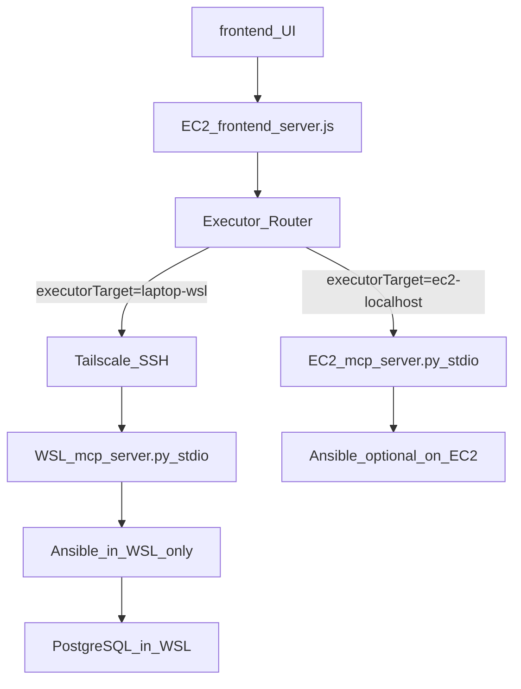

## Current setup: multi-executor MCP + Ansible (Tailscale)

### Topology (Phase 1: stdio-over-SSH)



### Roles
- Controller: EC2 (always)
- Executors:
  - `ec2-localhost` (default): local stdio MCP server, current behavior
  - `laptop-wsl` (opt-in): remote stdio MCP server launched in WSL via Tailscale SSH

### Where things run
- Frontend: EC2 only (`clos-medium/ansible-mcp-project/frontend/server.js`)
- Local MCP server (default executor): EC2 (`clos-medium/ansible-mcp-project/mcp_server.py`)
- Remote executor MCP server: WSL Ubuntu (`clos-medium/local-server/ansible-mcp-project/mcp_server.py`)
- Ansible:
  - Optional on EC2 (only if you explicitly choose to run locally)
  - Required in WSL for the laptop executor
- PostgreSQL: installed only inside WSL

### Required installs

#### EC2
- Node.js (for `frontend/server.js`)
- Python venv present in repo (for local MCP server)
- Tailscale installed and logged into the tailnet

#### Windows laptop
- Tailscale installed and logged into the same tailnet
- Tailscale SSH enabled (or Windows OpenSSH reachable via tailnet)

#### WSL Ubuntu (executor)
- Ansible installed
- Python3 installed
- Passwordless sudo configured (documented below)

### Passwordless sudo (WSL)
Do not store passwords in inventory. Configure passwordless sudo for your WSL user:

```bash
sudo visudo
```

Add:

```bash
<your_wsl_user> ALL=(ALL) NOPASSWD:ALL
```

### How a command flows end-to-end
1. User selects executor in UI dropdown (default `ec2-localhost`)
2. UI sends `/query` with `{ text, executorTarget }`
3. `frontend/server.js` routes tool execution:
   - `ec2-localhost`: spawns `mcp_server.py` locally (stdio JSON-RPC)
   - `laptop-wsl`: spawns WSL `mcp_server.py` over Tailscale SSH (stdio JSON-RPC)
4. Tools execute via allow-listed Ansible invocations

### Config knobs (Phase 1)

#### Selecting executor
- UI dropdown sends `executorTarget`
- Or set `EXECUTOR_TARGET` env var on EC2

#### Laptop executor SSH settings (set on EC2)
- `LAPTOP_SSH_TARGET` (required for `laptop-wsl`): e.g. `harshit@100.69.92.79` or `harshit@harshit`
- `LAPTOP_SSH_BIN` (optional): default `tailscale` (uses `tailscale ssh`)
- `LAPTOP_SSH_ARGS_JSON` (optional): JSON array of extra SSH args

#### WSL project location (on the laptop)
- `LAPTOP_WSL_PROJECT_ROOT` default: `~/local-server/ansible-mcp-project`

### Phase 2 (target)
Phase 2 keeps the same executor routing model and tool protocol but upgrades transport to persistent HTTP + SSE over Tailscale.


