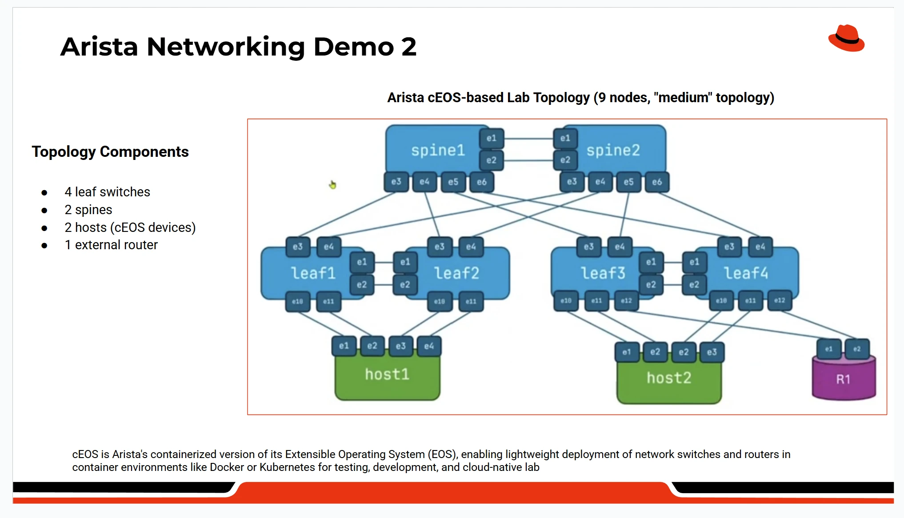

# Arista cEOS Medium Lab Topology

This document describes the **Arista cEOS–based medium lab topology** used for Ansible network automation demonstrations.

The lab is designed to closely represent a **real-world data center network**, while remaining safe and repeatable for demos and training.

---

## Topology Overview

---

## Topology Components

- **4 Leaf switches** (leaf1–leaf4)
- **2 Spine switches** (spine1–spine2)
- **2 End hosts** (host1, host2)
- **1 External router** (R1)

---

## What This Topology Demonstrates

This topology is used to demonstrate:

- VLAN automation and rollback
- Interface visibility and health reporting
- Conditional configuration logic (if/else)
- Configuration backup and operational reporting using Ansible
- End-to-end network behavior with connected hosts

---

## Detailed Topology Explanation

### Leaf Switches (leaf1 – leaf4)

**Role:** Access / Top-of-Rack (ToR) switches  

Leaf switches sit closest to servers in a real data center and are the primary devices where configuration changes happen.

**Automation demonstrated on leaf switches:**
- VLAN creation and removal
- Interface status checks (up/down)
- Conditional configuration logic
- Configuration backup and rollback

> Most real-world network automation use cases apply at the leaf layer, which is why this demo focuses heavily on these devices.

---

### Spine Switches (spine1 – spine2)

**Role:** Core / aggregation layer  

Spine switches interconnect all leaf switches and provide high-speed, resilient connectivity across the network fabric.

**Purpose in this demo:**
- Show a realistic multi-tier architecture
- Demonstrate visibility and reporting at scale
- Show that automation can safely target different device roles

> In this demo, spine switches are mainly used for **visibility and backup**, not frequent configuration changes.

---

### host1 and host2 (Endpoint Devices)

**Role:** Simulated end hosts / servers  

host1 and host2 represent application servers or client machines connected to the network.

**Important clarification:**
- host1 and host2 are **not network switches**
- They are **not leaf or spine devices**
- They are **not targets for Ansible network configuration**

**Why they exist:**
- To make the topology realistic
- To show how servers connect through leaf switches
- To validate that VLANs and interfaces work end-to-end

> Think of host1 and host2 as real servers connected to the network, not devices being automated.

---

### R1 (External Router)

**Role:** Edge / external connectivity  

R1 represents an external router connecting the data center fabric to upstream networks such as the internet or a WAN.

**Purpose in the demo:**
- Completes the topology
- Shows realistic upstream connectivity
- Not actively configured as part of the automation demos

---

## What Is Currently Automated and What Is Shown in DEMO

### Automated with Ansible
- Leaf switches
- Spine switches (visibility and backup)

### Shown for Realism Only
- host1 and host2
- External router (R1)

---

## Simple Summary

> Leaf and spine switches are the actual network devices we automate using Ansible.  
> host1 and host2 are example servers used to show how traffic flows through the network.

---
